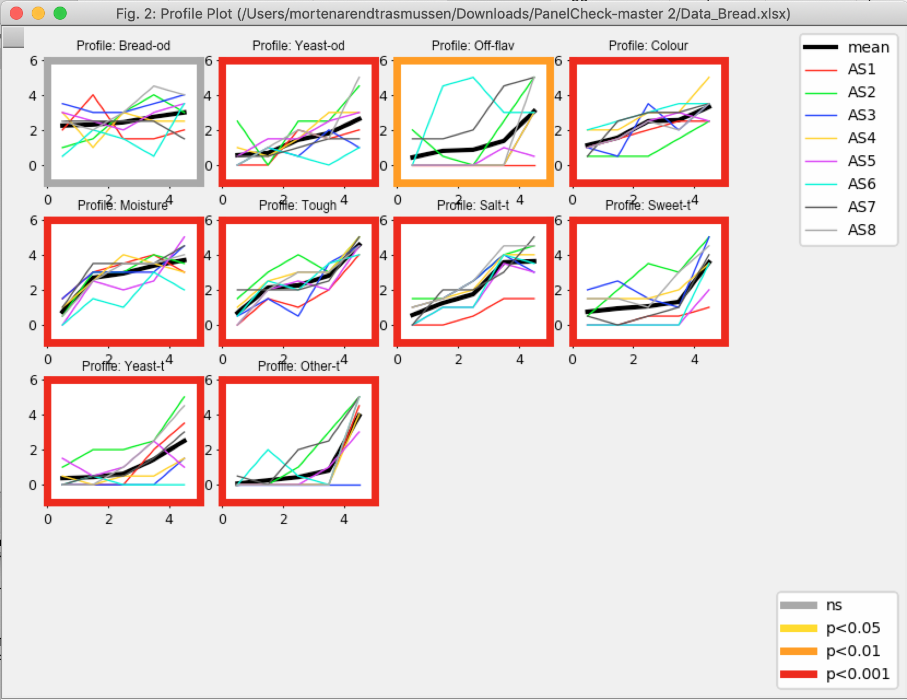

```{r setup, include=FALSE}
knitr::opts_chunk$set(echo = TRUE)
```


# FYI

This version of PanelCheck is unpolished. By this is meant that all the features
Regarding the actual data-analysis works but miscellaneous functionality such as the
_about section_ or _help section_ might not function as desired. 

# Windows ?

If you are using a windows mashine, please use PanelCheck distributed here <http://www.panelcheck.com/Home/panelcheck_downloads>

# Installation

## Requirements

You will need at least iOS __High Sierra__ 

## Download and your first launch

* Download this repository
* Unzip and place the folder somewhere meaningful on your computer ( _Not_ in Downloads)
* When you want to open the program first time, you will _NOT_ be able to doubleclick. Use __Finder__ to direct to the folder with the program, and then cmd+click on the icon. Then you will be prompted with this window where you hit enter. 

From now on you will be able to simple double-click on the program to get it running. 

# A minimal example 

A real toy example data [Data_Bread.xlsx](Data_Bread.xlsx) is included. Here follows a short demonstration

## Import data

Use File > Import > Excel... to locate the data. 
Here you need to make sure that the coloumns representing _Assessors_, _Samples_ and _Replicates_ are correctly identified by PanelCheck, furhter you are able to de-select some of the variables in the _Import Coloumns_. 

{width=300px}


When correctly mathced, hit __Accept__

## Plots
In the graphical user interface, you will find four main tabs; _Univariate_, _Multivariate_, _Consensus_ and _Overall_. In each main tab, several different plots are available.The red/orange/grey frame indicates level of signifcanse related to differences between samples for the particular attribute. 
Try to click on the different plot e.g.

### Univariate - Profile plots
Profile plots show individual(coloured lines) and consensus (black bold line) scoring (Y-axis) and ranking of samples (X-axis).

{width=300px}


### Multivariate - Tucker-1 plots 
Select the _Overview Plot (attributes)_.
This plot shows the consensus among panellists for the different attributes. Assessors grouping together in a cluster indicate??? good agreement between these.

![Import]

### Consensus - PCA scores
This plot shows which prodcuts are perceived Similar and different.


![Import]

### Overall- Overview plot 

Several statistical analyses can be conducted in PanelCheck as an example, a two way anova with interactions is conducted. 

Select _Overall_ at the top (to the right), and select _2-way ANOVA_ as analysis. This one because there are replicates. 
Select the _Overview Plot (F values)_. You should get something like this: 

{width=300px}

Here, the main effects (Assessor and Product) as well as their interaction, across all attributes (x-axis). The y-axis is the F-value, which indicates the level of differences with respect to the assessor or product or the combination: The higher, the larger the difference. Colors indicate the corresponding significance test p-value. A significant product/sample effect for a specific attribute tells that this attribute significantly discriminate the prodcuts/samples.

### Export a plot 

On the left at the bottom of a plot there are some action icons. The _disk_ is used for saving the particular plot. 

{width=200px}


